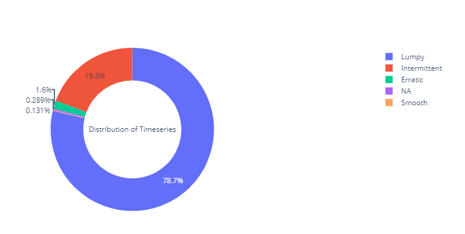
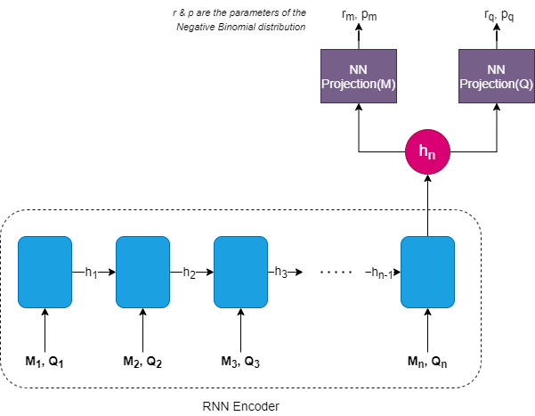

# GluonTS Implementation of Deep Renewal Processes
[](https://pypi.python.org/pypi/deeprenewal)
[](https://travis-ci.com/manujosephv/deeprenewalprocess)
[](https://deeprenewalprocess.readthedocs.io/en/latest/?badge=latest)
[](https://github.com/manujosephv/deeprenewalprocess/issues)
[](https://colab.research.google.com/github/manujosephv/deeprenewalprocess/blob/master/examples/Forecasting%20with%20DeepRenewalProcess.ipynb)


> Intermittent Demand Forecasting with Deep Renewal Processes
> Ali Caner Turkmen, Yuyang Wang, Tim Januschowski

## Table of Contents

- [Installation](#installation)
- [Dataset](#dataset)
    - [Download](#download)
    - [Description](#description)
- [Model](#model)
- [Usage](#usage)
    - [Train](#train)
- [Result](#result)
- [Blog](#blog)
- [References](#references)

## Installation

*Recommended Python Version*: 3.6

```
    pip install deeprenewal
```

If you are working Windows and need to use your GPU(which I recommend), you need to first install MXNet==1.6.0 version which supports GPU
[MXNet Official Installation Page](https://mxnet.apache.org/versions/1.6.0/get_started?platform=windows&language=python&processor=gpu&environ=pip&)

And if you are facing difficulties installing the GPU version, you can try(depending on the CUDA version you have)

```
pip install mxnet-cu101==1.6.0 -f https://dist.mxnet.io/python/all
```

[Relevant Github Issue](https://github.com/apache/incubator-mxnet/issues/17719)


The sources for DeepRenewal can be downloaded from the `Github repo`_.

You can either clone the public repository:

```
git clone git://github.com/manujosephv/deeprenewalprocess
```

Once you have a copy of the source, you can install it with:
```
python setup.py install
```

## Dataset

### Download

[Retail Dataset](https://archive.ics.uci.edu/ml/datasets/online+retail)

### Description

It is a transactional data set which contains all the transactions occurring between 01/12/2010 and 09/12/2011 for a UK-based and registered non-store online retail. The company mainly sells unique all-occasion gifts. Many customers of the company are wholesalers.

Columns:

* InvoiceNo: Invoice number. Nominal, a 6-digit integral number uniquely assigned to each transaction. If this code starts with letter ‘c’, it indicates a cancellation.
* StockCode: Product (item) code. Nominal, a 5-digit integral number uniquely assigned to each distinct product.
* Description: Product (item) name. Nominal.
* Quantity: The quantities of each product (item) per transaction. Numeric.
* InvoiceDate: Invice Date and time. Numeric, the day and time when each transaction was generated.
* UnitPrice: Unit price. Numeric, Product price per unit in sterling.
* CustomerID: Customer number. Nominal, a 5-digit integral number uniquely assigned to each customer.
* Country: Country name. Nominal, the name of the country where each customer resides.

#### Preprocessing:

* Group by at StockCode, Country, InvoiceDate –> Sum of Quantity, and Mean of UnitPrice
* Filled in zeros to make timeseries continuous
* Clip lower value of Quantity to 0(removing negatives)
* Took only Time series which had length greater than 52 days.
* Train Test Split Date: 2011-11-01

#### Stats:

* No. of Timeseries: 3828. After filtering: 3671
* Quantity: Mean = 3.76, Max = 12540, Min = 0, Median = 0
* Heavily Skewed towards zero

#### Time Series Segmentation


We can see that almost 98% of the timeseries in the dataset are either Intermittent or Lumpy, which is perfect for our use case.

## Model


## Usage

### Train with CLI

```
usage: deeprenewal [-h] [--use-cuda USE_CUDA] 
                   [--datasource {retail_dataset}]
                   [--regenerate-datasource REGENERATE_DATASOURCE]
                   [--model-save-dir MODEL_SAVE_DIR]
                   [--point-forecast {median,mean}]
                   [--calculate-spec CALCULATE_SPEC] 
                   [--batch_size BATCH_SIZE]
                   [--learning-rate LEARNING_RATE] 
                   [--max-epochs MAX_EPOCHS]
                   [--number-of-batches-per-epoch NUMBER_OF_BATCHES_PER_EPOCH]
                   [--clip-gradient CLIP_GRADIENT]
                   [--weight-decay WEIGHT_DECAY]
                   [--context-length-multiplier CONTEXT_LENGTH_MULTIPLIER]
                   [--num-layers NUM_LAYERS] 
                   [--num-cells NUM_CELLS]
                   [--cell-type CELL_TYPE] 
                   [--dropout-rate DROPOUT_RATE]
                   [--use-feat-dynamic-real USE_FEAT_DYNAMIC_REAL]
                   [--use-feat-static-cat USE_FEAT_STATIC_CAT]
                   [--use-feat-static-real USE_FEAT_STATIC_REAL]
                   [--scaling SCALING]
                   [--num-parallel-samples NUM_PARALLEL_SAMPLES]
                   [--num-lags NUM_LAGS] 
                   [--forecast-type FORECAST_TYPE]

GluonTS implementation of paper 'Intermittent Demand Forecasting with Deep
Renewal Processes'

optional arguments:
  -h, --help            show this help message and exit
  --use-cuda USE_CUDA
  --datasource {retail_dataset}
  --regenerate-datasource REGENERATE_DATASOURCE
                        Whether to discard locally saved dataset and
                        regenerate from source
  --model-save-dir MODEL_SAVE_DIR
                        Folder to save models
  --point-forecast {median,mean}
                        How to estimate point forecast? Mean or Median
  --calculate-spec CALCULATE_SPEC
                        Whether to calculate SPEC. It is computationally
                        expensive and therefore False by default
  --batch_size BATCH_SIZE
  --learning-rate LEARNING_RATE
  --max-epochs MAX_EPOCHS
  --number-of-batches-per-epoch NUMBER_OF_BATCHES_PER_EPOCH
  --clip-gradient CLIP_GRADIENT
  --weight-decay WEIGHT_DECAY
  --context-length-multiplier CONTEXT_LENGTH_MULTIPLIER
                        If context multipler is 2, context available to hte
                        RNN is 2*prediction length
  --num-layers NUM_LAYERS
  --num-cells NUM_CELLS
  --cell-type CELL_TYPE
  --dropout-rate DROPOUT_RATE
  --use-feat-dynamic-real USE_FEAT_DYNAMIC_REAL
  --use-feat-static-cat USE_FEAT_STATIC_CAT
  --use-feat-static-real USE_FEAT_STATIC_REAL
  --scaling SCALING     Whether to scale targets or not
  --num-parallel-samples NUM_PARALLEL_SAMPLES
  --num-lags NUM_LAGS   Number of lags to be included as feature
  --forecast-type FORECAST_TYPE
                        Defines how the forecast is decoded. For details look
                        at the documentation
```

An example of training process is as follows:

```
python3 deeprenewal --datasource retail_dataset --lr 0.001 --epochs 50
```
### Train with Jupyter Notebook

Check out the examples folder for notebooks

## Result

| Method             | QuantileLoss[0.25] | QuantileLoss[0.5] | QuantileLoss[0.75] | mean_wQuantileLoss |
|--------------------|--------------------|-------------------|--------------------|--------------------|
| Croston            | 664896.9323        | 791880.3858       | 918863.8392        | 1.034257626        |
| SBA                | 623338.1011        | 776084.5519       | 928831.0028        | 1.013627034        |
| SBJ                | 627880.7754        | 779758.6188       | 931636.4622        | 1.018425652        |
| ARIMA              | 598779.2977        | 784662.7412       | 957980.814         | 1.019360367        |
| ETS                | 622502.7789        | 796128.4          | 957808.4087        | 1.03460523         |
| DeepAR             | **378217.1822**        | **679862.7643**       | **808336.3482**        | **0.812561813**        |
| NPTS               | 380956             | 725255            | 935102.5           | 0.88870495         |
| DeepRenewal Flat   | 383524.4007        | 764167.8638       | 1047169.894        | 0.955553796        |
| DeepRenewal Exact  | 382825.5           | 765640            | 1141210.5          | 0.99683189         |
| DeepRenewal Hybrid | 389981.2253        | 761474.4966       | 1069187.032        | 0.96677762         |

## Blog

For a more detailed account of the implementation and the experiments please visit the blog:
https://deep-and-shallow.com/2020/10/13/intermittent-demand-forecasting-with-deep-renewal-processes/


## References

[1] Ali Caner Turkmen, Yuyang Wang, Tim Januschowski. [*"Intermittent Demand Forecasting with Deep Renewal Processes"*](https://arxiv.org/pdf/1911.10416.pdf). arXiv:1911.10416 [cs.LG] (2019)
[2] Alexander Alexandrov, Konstantinos Benidis, Michael Bohlke-Schneider, Valentin Flunkert, Jan Gasthaus, Tim Januschowski, Danielle C. Maddix, Syama Rangapuram, David Salinas, Jasper Schulz, Lorenzo Stella, Ali Caner Türkmen, Yuyang Wang;. [*"GluonTS: Probabilistic and Neural Time Series Modeling in Python"*](https://www.jmlr.org/papers/v21/19-820.html). (2020).